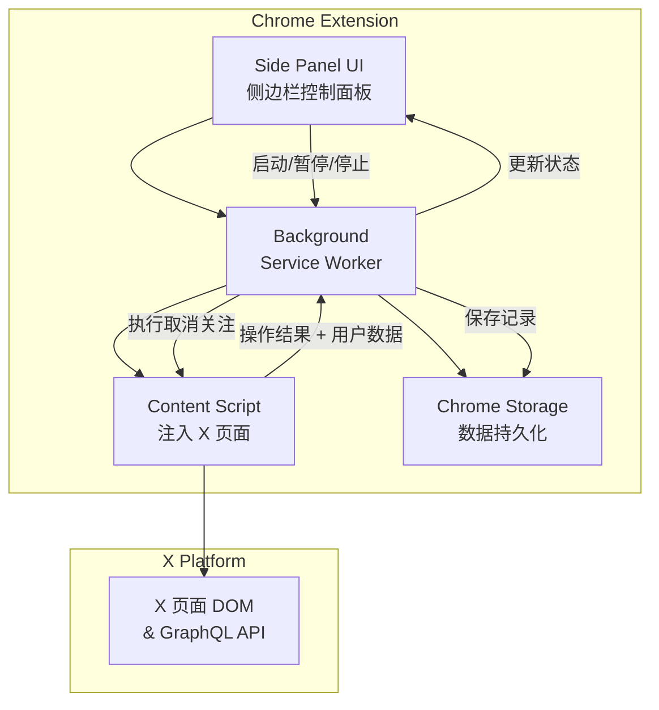

# 🐦 X Unfollower - X 平台批量取消关注工具

> 一款 Chrome 扩展，帮助用户智能管理 X (Twitter) 关注列表，批量取消关注不互关或非蓝 V 的账号。

---

## 🎯 核心痛点

| 痛点 | 描述 |
|------|------|
| 关注列表膨胀 | 长期使用后关注了大量不再感兴趣的账号 |
| X 官方限制 | 官方只能逐个取消关注，效率极低 |
| 无法筛选 | 无法按条件（如不互关、非蓝 V）批量筛选 |
| 操作繁琐 | 每次取消关注都需要点击多次 |

---

## 🏗️ 功能模块设计

### 1. 📊 关注列表分析面板（Side Panel 侧边栏）

- **展示方式**：使用 Chrome Side Panel API 以侧边栏方式展示，不遮挡 X 页面
- **总览统计**：关注数、不互关数、蓝 V 数、白名单数
- **分类展示**：
  - 🔴 **不互关** — 你关注了对方，但对方没关注你
  - 🔵 **非蓝 V** — 没有 X Premium 认证的账号
  - 🟢 **互关** — 双向关注的账号
  - ⚪ **已保护** — 用户手动标记的白名单账号
- **搜索功能**：支持按用户名 / 昵称实时搜索筛选

### 2. 🔍 蓝 V (Blue Verified) 检测

- **数据来源**：通过 X GraphQL API 响应中的 `is_blue_verified` 字段判断
- **UI 标记**：蓝 V 用户在列表中显示蓝色认证勾标记
- **筛选支持**：可按「非蓝 V」筛选，快速找出未认证的关注

### 3. 🗑️ 单个取关 + 安全限制

- 每个用户卡片右侧独立「取关」按钮，**不支持批量**
- 点击取关 → 确认弹窗 → 执行 → 按钮变为「已取关」
- **每日上限 50 次**：达到后禁用所有取关按钮 + 提示用户
- 底部显示今日取关进度（如「今日已取关 3/50」）
- 每次取关记录到操作历史
- 每天自动重置计数

### 4. 🛡️ 白名单保护

- 手动添加账号到白名单，永远不会被误取消关注
- 白名单标记在列表中高亮显示

### 5. 📈 操作历史记录

- 记录每次取消关注的操作
- 支持查看历史取消关注的账号列表

---

## 🛠️ 技术架构

### 技术栈

```
├── Manifest V3          # Chrome 扩展标准
├── Vite + CRXJS         # 构建工具 + HMR
├── HTML + CSS + JS      # Side Panel & UI
├── Content Script       # 注入 X 页面，操作 DOM
├── Background (SW)      # Service Worker 后台逻辑
├── Chrome Side Panel    # 侧边栏展示 UI
└── Chrome Storage API   # 本地数据持久化
```

### 架构图



### Side Panel vs Popup 对比

| 特性 | Popup (旧) | Side Panel (新) |
|------|-----------|-----------------|
| 展示空间 | 400x600 固定 | 全屏高度侧边栏 |
| 与页面共存 | ❌ 点击外部关闭 | ✅ 始终可见 |
| 操作连续性 | ❌ 关闭后中断 | ✅ 持续操作 |
| 用户体验 | 频繁打开关闭 | 自然嵌入浏览 |

---

## 📂 项目文件结构

```
x-unfollower/
├── manifest.json              # 扩展配置 (MV3 + sidePanel)
├── package.json               # npm 配置
├── vite.config.js             # Vite + CRXJS 配置
├── src/
│   ├── sidepanel/
│   │   ├── index.html         # 侧边栏主页面
│   │   ├── main.js            # 入口 (import CSS)
│   │   ├── sidepanel.css      # 侧边栏样式
│   │   └── helpers.js         # 工具函数
│   ├── background/
│   │   └── service-worker.js  # 后台任务协调
│   ├── content/
│   │   └── content.js         # 内容脚本（注入 X 页面）
│   ├── utils/
│   │   ├── rate-limiter.js    # 速率控制器
│   │   └── storage.js         # 存储管理封装
│   ├── styles/
│   │   └── common.css         # 公共样式变量/主题
│   └── assets/icons/          # 扩展图标
└── dist/                      # 构建输出
```

---

## 🎨 UI 设计思路

### Side Panel 侧边栏

```
┌──────────────────────────────┐
│  🐦 X Unfollower        v1.0│
├──────────────────────────────┤
│                              │
│  ┌──────┐ ┌──────┐          │
│  │ 1234 │ │  890 │          │
│  │ 关注  │ │不互关 │          │
│  └──────┘ └──────┘          │
│  ┌──────┐ ┌──────┐          │
│  │  56  │ │  12  │          │
│  │ 蓝V  │ │白名单 │          │
│  └──────┘ └──────┘          │
│                              │
│  ━━━━━━━━━━ 3/50         │
│                              │
│  ┌────────────────────────┐  │
│  │ 📊 扫描关注列表        │  │
│  └────────────────────────┘  │
│                              │
│  🔍 搜索用户...              │
│                              │
│  [全部] [不互关] [非蓝V] [互关]│
│                              │
│  ☐ @user1  🔵  不互关  [取关] │
│  ☐ @user2      不互关  [取关] │
│  ☐ @user3  🔵  互关    [取关] │
│  ☐ @user4      不互关  [取关] │
│  ...                         │
│                              │
│  今日已取关: 3/50             │
│  ━━━━━━━━━━░░░░░░░░░░ 3/50   │
└──────────────────────────────┘
```

### 设计风格

- **暗色主题**为主（匹配 X 的深色模式）
- **毛玻璃效果**卡片容器
- **渐变按钮**使用 X 品牌蓝色 (#1D9BF0) 作为主色调
- **流畅动画**：列表加载、进度条、操作反馈
- **徽章 & 标签**：蓝 V 用蓝色勾、不同状态用彩色标签区分

---

## ⚠️ 关键挑战与解决方案

### 1. X 的反自动化检测

| 挑战 | 解决方案 |
|------|----------|
| 频率限制 | 随机间隔 + 指数退避 + 可配置速率 |
| 行为检测 | 模拟真实的鼠标事件和点击行为 |
| Token 失效 | 自动检测失效并暂停，提示用户刷新 |

### 2. 蓝 V 检测准确性

| 挑战 | 解决方案 |
|------|----------|
| API 数据可能缺失 | 优先 GraphQL `is_blue_verified`，DOM 蓝勾 SVG 作 fallback |
| 企业/政府认证区分 | 通过 `verified_type` + `affiliates_highlighted_label` 综合判断 |

### 3. Side Panel 兼容性

| 挑战 | 解决方案 |
|------|----------|
| 旧版 Chrome 不支持 | Chrome 114+ 才支持 Side Panel，最低版本要求标注 |
| 窗口尺寸受限 | 使用响应式布局，宽度自适应 |

---

## 🔐 权限需求

```json
{
  "permissions": [
    "activeTab",
    "storage",
    "sidePanel"
  ],
  "host_permissions": [
    "https://x.com/*",
    "https://twitter.com/*"
  ]
}
```

| 权限 | 用途 |
|------|------|
| `activeTab` | 获取当前 X 标签页信息 |
| `storage` | 存储白名单、操作历史、用户设置 |
| `sidePanel` | 在侧边栏展示扩展 UI |
| `host_permissions` | 需要在 X 页面注入 Content Script |

---

## 💡 差异化亮点

1. **侧边栏体验** — 不遮挡页面，可持续操作，优于弹窗式工具
2. **蓝 V 检测** — 快速识别 Premium 认证用户，精准筛选
3. **实时搜索** — 快速定位特定用户
4. **智能速率控制** — 随机间隔 + 退避策略规避检测
5. **白名单保护** — 防止误取消重要关注
6. **纯本地存储** — 所有数据存在本地，不上传服务器，保护用户隐私

---

## 📌 注意事项

> [!WARNING]
> X 平台的 API 和页面结构可能随时改变，Content Script 需要做好兼容处理，建议使用多种选择器作为 fallback。

> [!CAUTION]
> 频繁的取消关注操作可能导致 X 账号被暂时限制功能，务必做好速率控制和风险提示。

> [!NOTE]
> 本项目仅使用 Chrome Storage 进行本地数据存储，不涉及任何第三方服务器，用户数据安全有保障。
> Side Panel API 需要 Chrome 114+，使用前请确保浏览器版本兼容。
